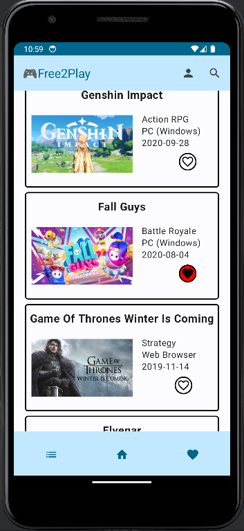
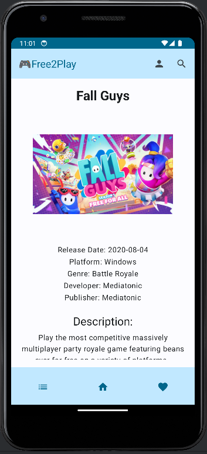
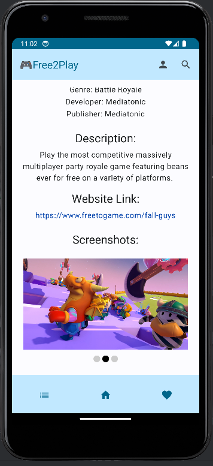
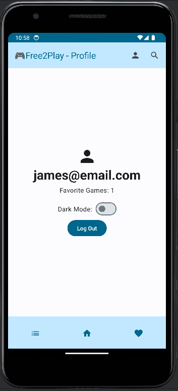
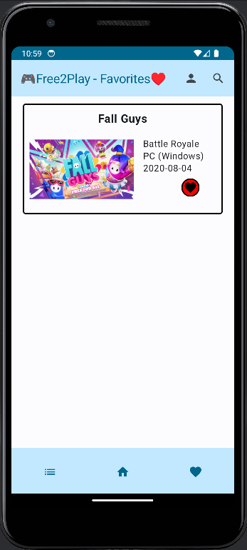
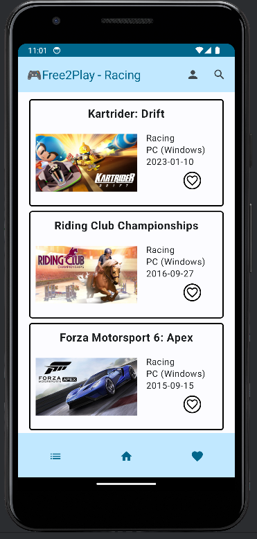
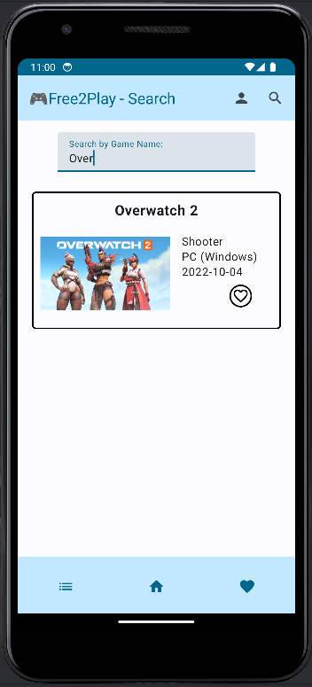

# Free2Play

Free2Play is an Android app that allows users to access a curated list of quality free to play video games. Users can browse games by search, category, and sign in to save their favorite games.

Data for this project was retrieved from [FreeToGame](https://www.freetogame.com/).

## View Popular Games

Our home screen displays the most popular f2p games in a scrollable list view. Users can select games for more granular details including screenshots, or favorite them for later viewing.

## Login to Save Favorites

Create an account and login to Free2Play to manage your own list of favorite games.

## Browse by Category and Search

Browse games by their associated genres, or search by title.

